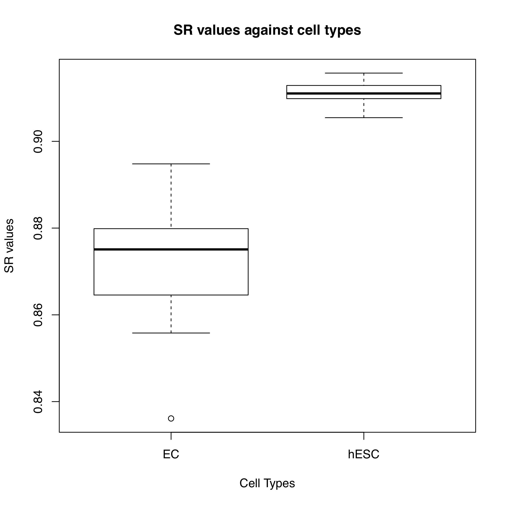
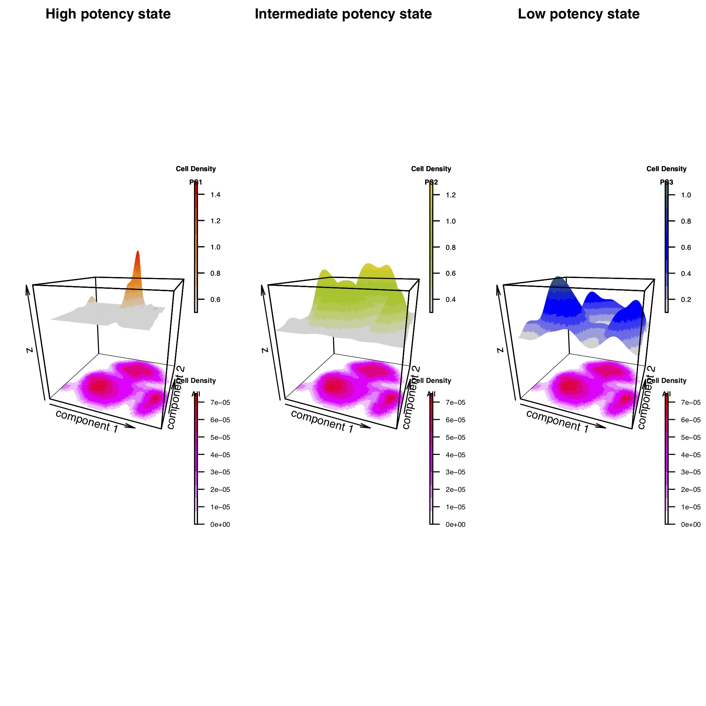
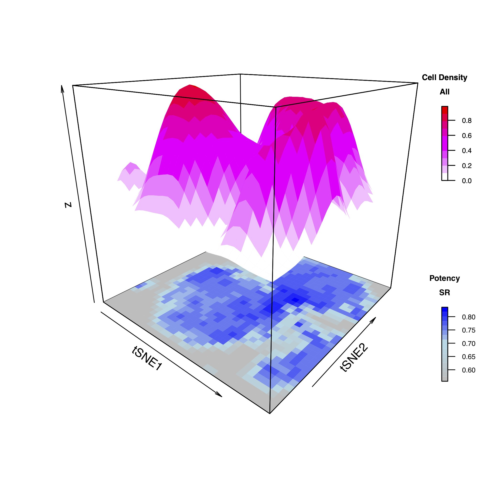

```{r vignette-options, echo=FALSE, message=FALSE, warning=FALSE}
require(BiocStyle)
```

# Introduction

The main purpose of the `LandSCENT` package is to provide a means of estimating the differentiation potency of single cells without the need to assume prior biological knowledge (e.g. marker expression or timepoint). As such, it may provide a more unbiased means for assessing potency or pseudotime.
The package features:

* Provided input arguments for `SingleCellExperiment` class and `CellDataSet` class for interoperability with a wide range of other Bioconductor packages, like `r Biocpkg("scater")` and `r Biocpkg("monocle")`;
* Tools for visualising entropy values of scRNA-seq data, especially 3D density plots with cell clusters;
* Inferring distinct differential potency states for a certain scRNA-seq dataset;
* Similar application to both single cell RNA-seq data and bulk RNA-seq data, and providing functions comparing each other.

This document gives a detailed tutorial of the `LandSCENT` package from data normalization to result visualization. `LandSCENT` package requires two main sources of input:

* Raw/Normalized single cell RNA-seq data
* User defined functional gene network

How to prepare these inputs for using in `LandSCENT` will be described in detail in the following sections.

# User defined functional gene network

`LandSCENT` requires as input a user defined functional gene network, for instance, a protein-protein interaction(PPI) network including the main interactions that take place in a cell. Although these networks are mere caricatures of the underlying signaling networks, ignoring time, spatial and biological contexts, one of the discoveries made recently is that cell potency appears to be encoded by a subtle positive correlation between transcriptome and connectome, with hubs in these networks generally exhibit higher expression in more potent cells. For details we refer the reader to our publications given at the end of this vignette[@SCENT1] and [@SCENT4]. 

In this vignette we will use a previously defined PPI network to calculate all the example results. The specific PPI network we use here is derived from [Pathway Commons](www.pathwaycommons.org), which is an integrated resource collating together PPIs from several distinct sources. In particular, the network is constructed by integrating the following sources: the Human Protein Reference Database (HPRD), the [National Cancer Institute Nature Pathway Interaction Database (NCI-PID)](pid.nci.nih.gov), the Interactome (Intact) and the Molecular Interaction Database (MINT).

We have stored the networks in the package. There are two versions of protein-protein interaction (PPI) network under filenames "ppiAsigH-PC2-17Jan2016.m.RData" and "hprdAsigH-13Jun12.m.RData"(early version). You can access these with the `data` function. Here we use the early version network:

```{r load network information, eval=TRUE, echo=TRUE, message=FALSE, warning=FALSE}
library(LandSCENT)
data(net13Jun12.m)
```

**One thing** needs to be stressed out: the nodes (genes) are labeled with Entrez gene ID, and the network is documented with entries "0" and "1". ”0” entries indicate that there is no interaction or connection between the two genes, while a ”1” means there is an interaction. *Importantly*, the diagonal entries are set to "0".

# Single cell RNA-seq data

We assume that you have a matrix/object containing expression count data summarised at the level of genes. You then need to do quality control and normalization on the data. 

**If you have a normalized data matrix already, you can directly go to the 4th section of this vignette.**

**Moreover, we provide input arguements for `SingleCellExperiment` (scater) and `CellDataSet` (monocle) class in `DoInegPPI` function. If you have objects of such two classes, could also directly go to the 4th section.**

Here we use a scRNA-Seq dataset from [@ChuData], generated with the Fluidigm C1 platform, as an example. Due to the package size restriction, we cannot store the whole data matrix in the package. However, the example is a sub-dataset of 100 cells with two cell types(*hESC* and *EC*). You can access the raw data and phenotype information using `data` function.

```{r quick load example data, eval=TRUE, echo=TRUE, message=FALSE, warning=FALSE}
data(rawExample.m)
data(phenoExample.v)
```

The full dataset can be downloaded from the GEO website under accession number [GSE75748](https://www.ncbi.nlm.nih.gov/geo/query/acc.cgi?acc=GSE75748), and the specific file to download is one of the supplementary file under filename "GSE75748_sc_cell_type_ec.csv.gz". You can download the dataset with `getGEOSuppFiles` function in `r Biocpkg("GEOquery")` package and extract the raw expression matrix from the supplementary files.

```{r download raw data, eval=FALSE, echo=TRUE, message=FALSE, warning=FALSE}
require(GEOquery)
require(Biobase)
GSE75748 <- getGEOSuppFiles("GSE75748")
gunzip(rownames(GSE75748)[3])
rawdata.m <- as.matrix(read.csv("GSE75748/GSE75748_sc_cell_type_ec.csv", row.names = 1))
```

We also provide the phenotype information of the full dataset in the package. It can be easily loaded into your session using `data` function.

```{r load phenotype informaton, eval=FALSE, echo=TRUE, message=FALSE, warning=FALSE}
data(phenoscChu.v)
```

## Quality control

Here we use `r Biocpkg("scater")` package to do quality control and normalizaion on the raw data. Since `LandSCENT` is rather robust to different normalization methods, you can always choose more suitable workflow for your own dataset, just guaranteeing the normalized data meet the specific requirements of `LandSCENT` package.
First, we create a `SingleCellExperiment` object containing the rawdata. Rows of the object correspond to genes, while columns correspond to single cells.

```{r setup sce object, eval=TRUE, echo=TRUE, message=FALSE, warning=FALSE}
require(scater)
example.sce <- SingleCellExperiment(assay = list(counts = rawExample.m))
```

Then, we detect low-quality cells based on library size and number of expressed genes in each library. We also select cells with low proportion of mitochondrial genes and spike-in RNA. Using the `isOutlier` function in `r Biocpkg("scater")` package with default arrguments, we remove 4 cells and most of them (3 cells) are filtered out because of high spike-in gene content.

```{r cell filtering part 1, eval=TRUE, echo=TRUE, message=FALSE, warning=FALSE}
### Detect mitochondrial gene and spike-in RNA

is.mito <- grepl("^MT", rownames(example.sce))
is.spike <- grepl("^ERCC", rownames(example.sce))

counts(example.sce) <- as(counts(example.sce), "dgCMatrix")
example.sce <- calculateQCMetrics(example.sce, feature_controls=list(Spike=is.spike, Mt=is.mito))

### Cell Filtering wih isOutlier function
 
libsize.drop <- isOutlier(example.sce$total_counts, nmads=5, type="lower", log=TRUE);
mito.drop <- isOutlier(example.sce$pct_counts_Mt, nmads=5, type="higher");
spike.drop <- isOutlier(example.sce$pct_counts_Spike, nmads=5, type="higher");
 
filter_example.sce <- example.sce[, !(libsize.drop | mito.drop | spike.drop)]
phenoExample.v <- phenoExample.v[!(libsize.drop | mito.drop | spike.drop)]
data.frame(ByLibSize=sum(libsize.drop), ByMito=sum(mito.drop), 
           BySpike=sum(spike.drop), Remaining=ncol(filter_example.sce))
example.sce <- filter_example.sce

```

## Normalization

After quality control, we then move to the normalization part. `r Biocpkg("scater")` package defines the size factors from the scaled library sizes of all cells.

```{r size factor, eval=TRUE, echo=TRUE, message=FALSE, warning=FALSE}
sizeFactors(example.sce) <- librarySizeFactors(example.sce)
```

Scaling normalization is then used to remove cell-specific biases, e.g. coverage or capture efficiency. Log-transformed normalized expression values can be simply computed with `normalize` function.

**Importantly**, we need to add an offset value of 1.1 before log-transformation. The offset is added in order to ensure that the minimum value after log-transformation would not be 0, but a nonzero value (typically log~2~1.1). We do not want zeroes in our final matrix since the computation of signaling entropy rate involves ratios of gene expression values and zeros in the denominator are undefined.

```{r normalization, eval=TRUE, echo=TRUE, message=FALSE, warning=FALSE}
example.sce <- normalize(example.sce, log_exprs_offset = 1.1)
example.m <- as.matrix(assay(example.sce, i = "logcounts"))
min(example.m)
```

## Check gene identifier 

Because `LandSCENT` will integrate the network with scRNA-Seq data, the row names and column names of the network must use the **same gene identifier** as used in the scRNA-Seq data.

In our example, rownames of the data matrix are all gene symbols. So we need to use `mapIds` function in `r Biocpkg("AnnotationDbi")` package along with `r Biocpkg("org.Hs.eg.db")` package to get corresponding Entrez gene ID.

```{r check gene identifier, eval=FALSE, echo=TRUE, message=FALSE, warning=FALSE}
require(AnnotationDbi)
require(org.Hs.eg.db)
anno.v <- mapIds(org.Hs.eg.db, keys = rownames(example.m), keytype = "SYMBOL", 
               column = "ENTREZID", multiVals = "first")
unique_anno.v <- unique(anno.v)
example_New.m <- matrix(0, nrow = length(unique_anno.v), ncol = dim(example.m)[2])
for (i in seq_len(length(unique_anno.v))) {
    tmp <- example.m[which(anno.v == unique_anno.v[i]) ,]
    if (!is.null(dim(tmp))) {
        tmp <- colSums(tmp) / dim(tmp)[1]
    }
    example_New.m[i ,] <- example_New.m[i ,] + tmp
}
rownames(example_New.m) <- unique_anno.v
colnames(example_New.m) <- colnames(example.m)
example_New.m <- example_New.m[-which(rownames(example_New.m) %in% NA) ,]
Example.m <- example_New.m
```

Now the scRNA-seq data are ready for the calculation of signaling entropy rate.

# How to use `LandSCENT` package

Before start introducing functionalities of `LandSCENT` package, we give several points for you to check, in case you skipped the one or two sections above:

* Make sure the diagonal elements in your network matrix are set to "0";
* Make sure scRNA-seq data use the **same gene identifier** with network matrix;
* Make sure the minimal expression value in your normalized scRNA-seq matrix/object is a positive (non-zero) number. We suggest a value of around 0.1.

And more notes for users with `SingleCellExperiment` and `CellDataSet` objects:

* `LandSCENT` accepts these two kinds of objects, and will do normalization inside the function process. So there is no need for you to normalize the data before implement `LandSCENT`. But it still requires the scRNA-seq data using the **same gene identifier** with network matrix.
* Use of function is identical to the scenario of data matrix. So in the following sections, we use data matrix as examples.

## Differentiation potency estimation

The estimation of differentiation potency with `LandSCENT` consists of two major steps:

* Integration of the scRNA-Seq data with the user-defined gene functional network.
* Computation of the Signaling Entropy Rate (denoted SR) which is used to approximate differentiation potency of single cells.

A typical workflow strats from integration of the scRNA-Seq data with the user-defined gene functional network. Here you can simply apply `DoIntegPPI` function on *Example.m* dataset and PPI network *net13Jun12.m*:

```{r , eval=TRUE, echo=FALSE, message=FALSE, warning=FALSE}
data(Example.m)
Example.m <- Example.m[, !(libsize.drop | mito.drop | spike.drop)]
```

```{r integrate scRNA-seq and PPI network, eval=TRUE, echo=TRUE, message=FALSE, warning=FALSE}
Integration.l <- DoIntegPPI(exp.m = Example.m, ppiA.m = net13Jun12.m)
str(Integration.l)
```

`DoIntegPPI` function takes these two arguments as input. The function finds the overlap between the gene identifiers labeling the network and those labeling the rows of the scRNA-seq matrix, and then extracts the maximally connected subnetwork, specified by the *adjMC* output argument. Also, the function constructs the reduced scRNA-Seq matrix, specified by the *expMC* output argument.

With the output object *Integration.l*, we can now proceed to compute the SR value for any given cell, using the `CompSRana` function. It takes five objects as input:

* The output object *Integration.l* from `DoIntegPPI` function;
* *local*, a logical parameter to tell the function whether to report back the normalized local, i.e. gene-centric, signaling entropies;
* *mc.cores*, the number of cores to use, i.e. at most how many child processes will be run simultaneously. We use `parallel` package in this function with a defult *mc.cores* value of 1.

```{r compute SR, eval=FALSE, echo=TRUE, message=FALSE, warning=FALSE}
SR.o <- CompSRana(Integration.l, local = TRUE, mc.cores = 40)
```

Here we run the `CompSRana` function with 40 cores, which means the computer should have at least 40 processing cores. In your case, you may set *mc.cores* value based on your own computer/sever.

The output argument *SR.o* is a list that added four elements onto the input *Integration.l*:

* *SR*: the SR value of the cells.
* *inv*: a matrix stores the invariant measure, or steady-state probability, for all the samples. That is, column labels the sample, and row labels the nodes in the *adjMC* matrix. Entries in every column add to 1.
* *s*: a matrix containing the unnormalized local signaling entropies, and therefore row number equals to the number of nodes in the *adjMC* matrix, column number equals to cell number.
* *ns*: if local=TRUE, a matrix containing normalized local signaling entropies.

**More** for users with `SingleCellExperiment` and `CellDataSet` classes: the SR values will also be added as a new phenotype information onto the original sce and cds objects with name `SR`.

One note with the above step: the local gene-based entropies can be used in downstream analyses for ranking genes according to differential entropy, but only if appropriately normalized. For instance, they could be used to identify the main genes driving changes in the global signaling entropy rate of the network. However, if the user only wishes to estimate potency, specifying *local=FALSE* is fine, which will save some RAM on the output object.

As we mentioned above, we provide the example's phenotype infromation in the package, stored in the *phenoExample.v* vector. With SR values and the phenotype information, you can then check that the SR values do indeed correlate with potency:

```{r load SR, eval=TRUE, echo=FALSE, message=FALSE, warning=FALSE}
data(SR.v)
Integration.l$SR <- SR.v
SR.o <- Integration.l
```

```{r boxplot, eval=FALSE, echo=TRUE, message=FALSE, warning=FALSE}
boxplot(SR.o$SR ~ phenoExample.v, main = "SR values against cell types", xlab = "Cell Types", ylab = "SR values")
```



Here *hESC* and *EC* refer to human embryonic stem cells and mesoderm progenitor cells, respectively.

## Infer the potency states in a cell population

Having estimated the cell potency values, we can then infer cell potency states with `InferPotency` function. This function provides the discrete potency states of single cells and its distribution across the single cell populations.

If you have no phenotype information, you can simply implement this method with above aforementioned object *SR.o*:

```{r InferPotency no pheno1, eval=FALSE, echo=TRUE, message=FALSE, warning=FALSE}
InferPotency.o <- InferPotency(SR.o)
```

Then the infered distinct potency states for every cell will be stored in the element named `potencyState`.

```{r InferPotency no pheno2, eval=FALSE, echo=TRUE, message=FALSE, warning=FALSE}
InferPotency.o$potencyState
```

But with the phenotype information provided, `InferPotency` function could tell the distribution of potency states in relation to cell-types:

```{r InferPotency with pheno1, eval=TRUE, echo=TRUE, message=FALSE, warning=FALSE}
InferPotency.o <- InferPotency(SR.o, pheno.v = phenoExample.v)
```

```{r InferPotency with pheno2, eval=TRUE, echo=TRUE, message=FALSE, warning=FALSE}
InferPotency.o$distPSPH
```

This result indicates that `InferPotency` function inferred 2 potency states, with the first potency state being occupied only by human embryonic stem cells(hESC), while the second potency state is enriched for mesoderm progenitor cells(EC).

Such results will also be stored for `SingleCellExperiment` and `CellDataSet` objects.

## Infer potency-coexpression clusters (landmarks)

Next step, we may want to explore the heterogeneity in potency within the cell population and infer lineage relationships. One way to approach this question is to use the `InferLandmark` function. 

This function identifies potency-coexpression clusters (landmark) of single cells called landmarks, and finally infers the dependencies of these landmarks which can aid in recontructing lineage trajectories.

With aforementioned result *InferPotency.o*, one can easily implement this function:

```{r InferLandmark v1, eval=TRUE, echo=TRUE, message=FALSE, warning=FALSE}
InferLandmark.o <- InferLandmark(InferPotency.o, pheno.v = phenoExample.v,
                                 reduceMethod = "PCA", clusterMethod = "PAM")
```

`InferLandmark` will do dimension reduction inside, so we provide two arguments, *reduceMethod* and *clusterMethod*, for you to decide the methods you want.

For *reduceMethod*, one can choose `tSNE` or `PCA`. And for *clusterMethod*, one can select `PAM` or `dbscan`.

The results of this function will be stored in a list named *InferLandmark.l* inside the output object. For examle, you can access the landmark index for every single cell with:

```{r InferLandmark v2, eval=TRUE, echo=TRUE, message=FALSE, warning=FALSE}
InferLandmark.o$InferLandmark.l$cl
```

You can also access the cell number distribution of phenotype against landmark with:

```{r InferLandmark v3, eval=TRUE, echo=TRUE, message=FALSE, warning=FALSE}
InferLandmark.o$InferLandmark.l$distPHLM
```

For more information, you can check the help pages.

## Application on bulk samples

One important feature of `LandSCENT` package is that it can also be applied on bulk RNA-seq data. The procedure is identical with single-cell RNA-Seq data, the only difference is in the specific preprocessing and normalization of the data.

## Density based visualization tool

```{r , eval=TRUE, echo=FALSE, message=FALSE, warning=FALSE}
data(tsne.o)
data(potS.v)
data(SR4.v)
potS.v <- 4 - potS.v
InferLandmark.o <- list(potencyState = potS.v, SR = SR4.v)
library(marray)
```

Here, we used an example dataset contains 3473 human breast epithelial cells from [@BreData] to show our density based visualiazation function `Plot_LandSR` and `Plot_CellSR`. 

### `Plot_LandSR` function

This function generates figures which compares cell density across different distinct potency states, which are inftered by `InferPotency` function. 

We provide arguments for you to choose whether to inherent dimension reduction result from the *InferLandmark.o* object, or to input the reduced diemension coordinates yourself. 

And you can specify the color between all cell density and distinct potency cell density.

The horizon lines of these density maps decrease from left to right, which indicates the cell potency states decrease from high (PS1) to low (PS3).

```{r Plot_LandSR , eval=FALSE, echo=TRUE, message=FALSE, warning=FALSE}
LandSR.o <- Plot_LandSR(InferLandmark.o, coordinates = tsne.o, colpersp = NULL, 
                        colimage = NULL, bty = "f", PDF = FALSE)
```



The output list *LandSR.o* will store the input coordinates as an element, in *LandSR.o$coordinates*. you can easily access it with

```{r tSNE matrix , eval=FALSE, echo=TRUE, message=FALSE, warning=FALSE}
LandSR.o$coordinates
```

### `Plot_CellSR` function

This function generates figures that shows cell density on top of cell SR value distribution.

We also provide arguments for you to choose whether to inherent dimension reduction result from the *InferLandmark.o* object, or to input the reduced diemension coordinates yourself. 

And you can specify the color of cell density and SR values distribution.

**Note** that the input argument *num-grid* is sensitive to the data size, which indicates the number of grid points in each direction. So it should be well asigned bsed on your own dataset. See more details in package help page.

```{r Plot_CellSR , eval=FALSE, echo=TRUE, message=FALSE, warning=FALSE}
CellSR.o <- Plot_CellSR(InferLandmark.o, coordinates = tsne.o, 
                        num_grid = 35, theta = 40, colpersp = NULL, 
                        colimage = NULL, bty = "f", PDF = FALSE)
```



The output list *CellSR.o* will also store the input coordinates as an element, in *CellSR.o$coordinates*.

## A "pipeline" function for easy use

In `LandSCENT`, we provide a function named `DoLandSCENT` for users do not care much about the intermedium results but the final information. 
It takes the scRNA-seq data and network matrix with some control arguments as its inputs. And return a list contains SR values, potency states and other results after running all the necessary functions. You can also control the plot via *PLOT* and *PDF* arguments.

```{r DoLandSCENT , eval=FALSE, echo=TRUE, message=FALSE, warning=FALSE}
DoLandSCENT.o <- DoLandSCENT(exp.m = Example.m, ppiA.m = net13Jun12.m,
                             mc.cores = 30, pheno.v = NULL, 
                             coordinates = NULL,
                             PLOT = FALSE, PDF = FALSE)
```

## Extract objects from function results

If users provided `SingleCellExperiment` or `CellDataSet` objects as the input, it then can be easily to extract the *sce* or *cds* from the results. The *sce* or *cds* objects are stored in the list with name **data.sce** and **data.cds**, respectively. And SR values and potency states are already been added to their phenotype information, so you can get such information in the **colData** or **pData**, respectively.

Take *SR.o* as an example:

```{r Extraction , eval=FALSE, echo=TRUE, message=FALSE, warning=FALSE}
result.sce <- SR.o$data.sce
result.cds <- SR.o$data.cds
```

With such object, you can then easily interact with *monocle*, *scater* and other packages.

# Session information

```{r sessionInfo, echo=T}
sessionInfo()
```

# References


